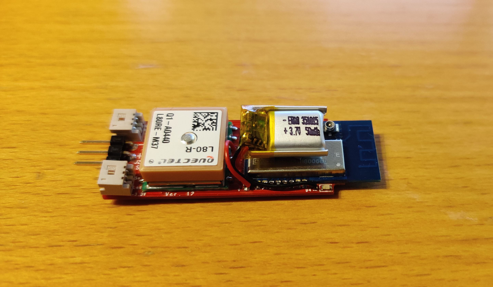

# RC Transponder (Locator Beacon)
After spending hours/days/weeks searching for lost RC Planes, I decided to design a single piece of hardware which can survive a crash and keep transmitting the GPS location.

## Design
<h4>The latest hardware version 12:</h4>

### Features (Crashed mode)
1. Get GPS coordinates from on-board GPS sensor.
2. Keeps operating if power from plane is lost (like in a crash). 
3. Continue to operate after a crash for ~14h with a beacon transmitted every 10 second.
4. Recharge onboard battery from planes power supply. (50mAh Lipo cell)

### Features (Normal mode)
1. Operate as primary Frsky GPS sensor ID4 on SMART Port (using [pawelsky's](https://www.rcgroups.com/forums/showthread.php?2245978-FrSky-S-Port-telemetry-library-easy-to-use-and-configurable) library).
2. Opperate as Mavlink to Passthrough converter for [Yaapu](https://github.com/yaapu/FrskyTelemetryScript) telemetry script for OpenTX.
3. Outputs other transponders location as StatusText messages via Passthrough to the Yaapu script. This means that when flying it can be used to listen for a crashed plane. This way other transponders will be displayed on the Radio: *"ADSB([CALLSIGN]): [GPS_LATITUDE],[GPS_LONGITUDE],[NUMBEROFSAT],[FIX(2d/3d)],[HDOP]"*

### Features (Locator mode)
1. When placed in module bay of a radio running OpenTX, it will listen for other transponder beacons and send there coordinats to the Radio as seconday GPS sensor (ID5).
 

### Settings*
1. When connected via USB to a PC, it will show as Serial(COM) port and simple commands can be sent.
2. A unique callsign (up to 8 charactors) can be set via USB port (setcallsign [callsign]). 
 *(Settings are stored in NVM and only cleared when flashing new firmware).

### CPU (ATSAMD21 - ARM Cortex-M0+):
This project uses the SAMD21 MCU from the the Arduino MKRZero.

### Radio module (EBYTE E28-2G4M20S 100mW Lora):
In order to reduce size of the antenna, I tired the 2.4GHz modules from EBYTE.
I tested the EBYTE E28-2G4M20S (100mW) found that when using Lora modulation with SF7, BW= 400KHz and CR=4/5, I could get a range of ~2km between two modules.
 
 
### GPS Sensor (Sierra Wireless PA6H or Quectel-L80-R):
The PA6H from Global Tech (now Sierra Wireless) was the smallest GPS I could find with a decent chip antenna. (UBLOX CAM-M8 was not tested but could also be relevant).
The PA6H only transmit NMEA strings, so the CPU has some extra Work here.
On Hardware version 12 the GPS was changed to Quectel-L80-R due to availablilty. 

## Hardware Versions
1. Version 12 Latest HW, USB on side, 2xDF13_3PINS + 1xSIL3. (size: 46.6mmx18.6mm).
2. Version 11 10pin DF13 as input connector. (size: 43.5mmx18.0mm).
3. Version 10 (first prototype) now obsolete. (size: 44.0mmx20.0mm).
 
## Hardware Layout and manufacturing
Schematic and layout is done in Cadence/Allegro. This section is shown with now obsolete version 10 harwdare.
10 prototypes PCB was ordered with stencil and then it's "just" pick and place the components (I only made two).
Board after pick and place but before reflow (see [RocketScream for DIY reflow own](http://www.rocketscream.com/blog/product/tiny-reflow-controller/)).

After reflow:

Then the top side is soldered (GPS/Radio/battery/connector and one LED) (MicroSD Card for scale):

Finished unit with heat shrink (alongside the first 433MHz prototype):

## Range Testing
One transponder was mounted on a chair with a laptop on the field and the other was mounted in a plane.
The transponder in the plane was set to send every second and the PC on the ground logged all the data.

It worked very well, and there were no problem with the range.
To push the system to the limits, I then mounted the transponder from the plane in my car, and drove away. I found a point ~2km away which (almost line of sight) where the transponder still worked, but the RSSI was very low and some of the incomming packages had CRC errors:

## Low Power Test
When running firmware v2.00 on harware version 12, the opperating time was 14.5hours. (Beacon every 10sec. GPS update every 10mins).

## Low Temperature Test
TBD (Pending hardware version 12)

# Software
The Software reflects that I started out using Arduino MKRZERO and the Arduino program and then imported it to Atmel Studio.

## Radio driver (EBYTE E28-2G4M20S) (Semtech SX1280)
I was not able to find any Arduino libraries for the SX1280 chip, and thus I started out using the demo code from Semtech, which I had to make some changes to until I got something which worked.

## GPS NMEA decoder (GSP80Lite)
Was a library I once made for the Arduino ATMEGA328P, so i reused it and added some more features. It still only decode GPGGA strings, which means that Date, COG and speed is not read yet. (Used in the FrSky GPS sensor.)

## Frsky SPORT library
I used this great library from [pawelsky](https://www.rcgroups.com/forums/showthread.php?2245978-FrSky-S-Port-telemetry-library-easy-to-use-and-configurable) However the ATSAMD21 chip is not supported and furthermore, I don't use single wire serial.
I did some changes to his library, including adding a passthoruth sensor for the Yaapu script. Please see the submodule [FrSky-S-Port-telemetry-library](https://github.com/KenLagoni/FrSky-S-Port-telemetry-library).
